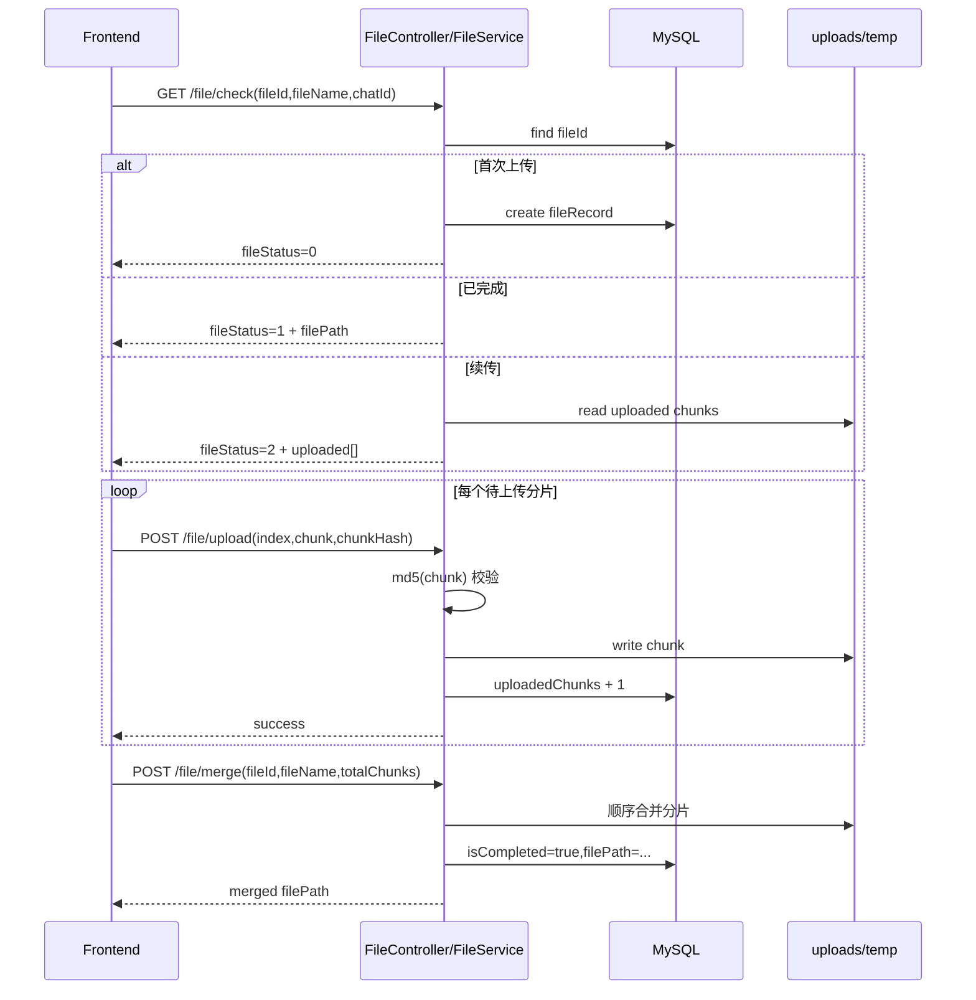
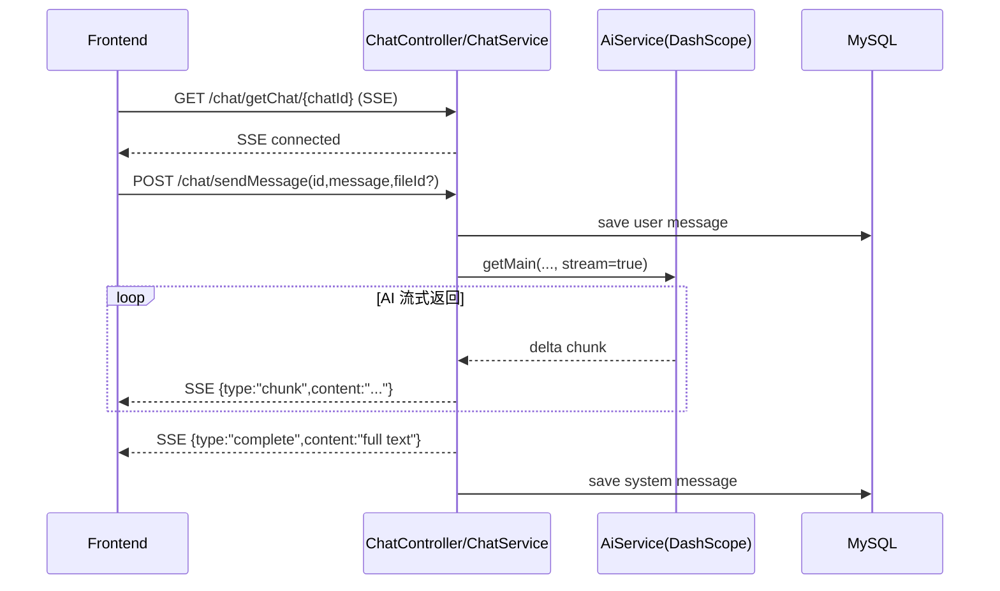

# AI-Chat-Be 后端实现详解（面向前端）

## 1. 文档目标
这份文档专门用于帮助前端同学理解 `AI-Chat-Be` 后端是怎么实现的，重点覆盖两条主链路：
1. 大文件上传（分片、续传、合并）
2. AI 对话（HTTP 触发 + SSE 流式返回）

后端目录：`AI-Chat-Be/`
前端目录：`AI-Chat/packages/ai-chat-pc/`

## 2. 后端整体做了哪些内容
后端基于 NestJS，核心模块如下：

- `users/`：注册、登录、JWT 发放
- `login.guard.ts`：全局登录守卫，校验 `Authorization` 里的 token
- `chat/`：会话创建、消息持久化、SSE 推流、触发 AI 回复
- `file/`：分片上传、秒传/续传检查、分片合并、文件记录
- `ai/`：对接阿里云 DashScope（OpenAI 兼容接口），调用 Qwen 模型
- `redis/`、`email/`、`agent/`：验证码/邮箱与扩展能力（不在本文重点）

### 2.1 基础设施能力
- 数据库：MySQL + TypeORM（`Chat`、`Message`、`FileEntity` 等实体）
- 鉴权：JWT（7 天有效），由全局 Guard 控制登录态
- 静态文件：`main.ts` 将本地 `uploads/` 映射为 `/uploads/` 可访问 URL
- 全局能力：ValidationPipe、统一响应拦截器、统一异常过滤器

## 3. 关键数据模型

### 3.1 Chat（会话）
- `id`：uuid
- `title`
- `userId`
- `isActive`（软删除标记）
- `createTime/updateTime`

关系：
- 一个 Chat 对应多条 Message
- 一个 Chat 对应多个 FileEntity

### 3.2 Message（消息）
- `id`：uuid
- `chatId`
- `role`：`user | system | assistant`
- `content`：文本
- `imgUrl`：图片数组（json）
- `fileContent`：文件元信息数组（json）
- `createdAt`

### 3.3 FileEntity（上传文件记录）
- `fileId`：前端算出的文件指纹
- `filePath`：后端可访问路径（如 `http://.../uploads/xxx.pdf`）
- `uploadedChunks`：已上传分片数
- `totalChunks`
- `isCompleted`
- `isCanceled`
- `chatId`

## 4. 大文件上传是怎么实现的

上传采用经典的「分片 + 断点续传 + 服务端合并」方案。

### 4.1 前端上传策略（`AIRichInput`）
前端在 `src/components/AIRichInput/index.tsx` 里做了这些事：

- 分片大小：`CHUNK_SIZE = 2MB`
- 并发上传：`CONCURRENT_UPLOADS = 3`
- 文件指纹：用 SparkMD5 对采样片段计算 `fileId`
- 分片校验：每个 chunk 再算一次 md5，作为 `chunkHash`

接口顺序：
1. `GET /file/check`：询问后端当前文件状态（未上传/已完成/可续传）
2. `POST /file/upload`：逐片上传（multipart，字段名 `chunk`）
3. `POST /file/merge`：全部完成后请求合并

### 4.2 后端接口语义

#### 1）`GET /file/check`
参数：`fileId`、`fileName`、`chatId?`

后端行为：
- 若 DB 无记录：创建初始记录，返回 `fileStatus = 0`
- 若已合并完成：返回 `fileStatus = 1` + `filePath`（秒传场景）
- 若未完成：读取 `uploads/temp/{fileId}` 下已存在分片，返回 `fileStatus = 2` + `uploaded[]`

#### 2）`POST /file/upload`
参数：`fileId`、`fileName`、`index`、`chunkHash`、`chunk`

后端行为：
- 查找 fileRecord，保证该文件流程已登记
- 计算分片 md5，必须与 `chunkHash` 一致
- 分片写入 `uploads/temp/{fileId}/{index}`
- `uploadedChunks += 1` 并落库

#### 3）`POST /file/merge`
参数：`fileId`、`fileName`、`totalChunks`

后端行为：
- 校验 `uploadedChunks === totalChunks`
- 按索引顺序读取临时分片并写入 `uploads/{fileName}`
- 删除临时分片目录
- 更新 DB：`isCompleted = true`、`filePath`、`totalChunks`
- 调用 `attachFileToChat(fileId, chatId)` 把文件挂到会话

#### 4）`POST /file/cancel`
后端支持取消上传并清理临时分片。

注意：当前前端“取消上传”主要是中断请求（`AbortController`），并未调用 `/file/cancel`，因此后端临时分片可能保留。

### 4.3 上传流程时序图

## 5. AI 对话是怎么实现的

对话采用「HTTP 触发生成 + SSE 回传增量 token」的双通道模式。

### 5.1 前端调用方式
文件：`src/apis/chat.ts` + `src/components/AIRichInput/index.tsx`

核心步骤：
1. 前端先建立 SSE：`GET /chat/getChat/:chatId`
2. 再调用发送消息接口：`POST /chat/sendMessage`（携带 `id/chatId`、`message`、`fileId?`）
3. 监听 SSE `onmessage`，逐段拼接回复

SSE 消息格式（后端发出）：
- `type: "chunk"`：增量片段
- `type: "complete"`：完整结束
- `type: "error"`：生成失败

### 5.2 后端对话主链路

#### 入口 1：`GET /chat/getChat/:id`（SSE）
- `ChatService` 为每个 chatId 维护一个 `Subject<MessageEvent>`
- 客户端连接后订阅这个 Subject

#### 入口 2：`POST /chat/sendMessage`
- Controller 校验参数
- 调 `chatService.useGeminiToChat(sendMessageDto)`

#### `useGeminiToChat` 的关键步骤
1. 如果传了 `fileId`，先查文件记录，拿到 `filePath`
2. 先保存用户消息到 `message` 表（role=`user`，含 fileContent/imgUrl）
3. 调 `aiService.getMain(message, filePath, imgUrl)` 获取流式 completion
4. `for await` 遍历 AI chunk，每次通过 SSE 推 `type=chunk`
5. 全部结束后推 `type=complete`，并保存系统消息（role=`system`）
6. 如果异常，推 `type=error`

### 5.3 AI 服务实现细节（`ai.service.ts`）
- SDK：`openai` 包
- BaseURL：`https://dashscope.aliyuncs.com/compatible-mode/v1`
- 文件场景：先把本地文件上传到模型文件接口，得到 `fileid://...`
- 模型选择：
  - 普通文档：`qwen-long`
  - 图片扩展名：`qwen-vl-plus`
- 调用参数：`stream: true`，所以后端可以边收到边通过 SSE 推给前端

### 5.4 对话流程时序图

## 6. 前后端如何协作（落地要点）

### 6.1 鉴权约定
- 后端 Guard 读取 `Authorization` 头直接验 token
- 前端 axios 请求拦截器统一加 `Authorization: <token>`
- SSE 使用 `EventSourcePolyfill`，同样通过 header 带 token

### 6.2 文件与对话关联
当前实现里，`merge` 后会尝试 `attachFileToChat`，因此推荐流程是：
1. 先确保已有 `chatId`
2. 再上传并合并文件
3. 最后 `sendMessage` 带 `fileId`

如果在“会话未创建时就上传文件”，`chatId` 可能为空，会影响文件绑定到会话。

### 6.3 本地文件访问
后端把 `uploads/` 暴露为静态目录，前端收到 `filePath` 后可直接访问。

## 7. 当前实现中的注意点（建议后续优化）

1. `ai.service.ts` 里 API Key 写在代码中，建议立即改为环境变量。
2. 前端取消上传未调用 `/file/cancel`，建议补齐，避免残留临时分片。
3. `uploadedChunks += 1` 未做幂等防重，重复上传同一分片可能计数偏大。
4. 合并时直接使用原始 `fileName`，建议增加重名策略与安全校验。
5. 若需要超大规模上传，建议引入对象存储（OSS/S3）+ 服务端仅做签名与回调。
6. 若需要更稳定流式通道，可补充 SSE 心跳和断线重连策略。

## 8. 快速定位代码

后端关键文件：
- `AI-Chat-Be/src/file/file.controller.ts`
- `AI-Chat-Be/src/file/file.service.ts`
- `AI-Chat-Be/src/chat/chat.controller.ts`
- `AI-Chat-Be/src/chat/chat.service.ts`
- `AI-Chat-Be/src/ai/ai.service.ts`
- `AI-Chat-Be/src/main.ts`
- `AI-Chat-Be/src/login.guard.ts`

前端关键文件：
- `AI-Chat/packages/ai-chat-pc/src/apis/chat.ts`
- `AI-Chat/packages/ai-chat-pc/src/components/AIRichInput/index.tsx`
- `AI-Chat/packages/ai-chat-pc/src/utils/request.ts`

---
如果你需要，我可以再补一版「接口字段级别的契约文档（请求/响应 JSON 示例）」用于前后端联调。
