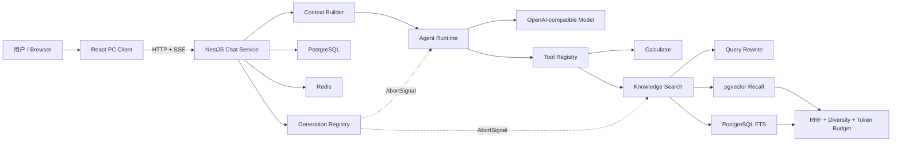

# Flow-Chat

> 一个面向个人知识库的可解释 Agentic RAG 对话平台。

[](./AI-Chat)
[](./AI-Chat-Be)
[](./AI-Chat-Be/docker-compose.yml)
[](./AI-Chat-Be/src)
[](./AI-Chat-Be/evaluation)

Flow-Chat 不只是一个大模型 API 聊天页面。项目围绕 Agent 的执行边界、RAG 检索质量、长会话上下文、推理过程可解释性和流式生成可靠性，构建了一套可控制、可观测、可评测的 AI 应用工程。

前端采用 React、TypeScript、Zustand 与 Ant Design；后端采用 NestJS、PostgreSQL、pgvector、Redis 与 OpenAI-compatible API。系统支持模型自主选择工具、知识库问答、Retrieval Trace、Summary Memory、SSE 断流恢复以及真正贯穿服务端链路的停止生成。

## 核心亮点

### 1. 可控 Agent Runtime

- 基于 OpenAI-compatible Tool Calling，让模型自主决定直接回答或调用 `knowledge_search`、`calculator`。
- 通过 Tool Registry 管理工具定义、参数 Schema、执行器与统一返回协议。
- 使用 Zod 校验模型生成的参数，并限制最大工具轮数和 Agent 总执行时间。
- Calculator 使用受限表达式解析，不直接执行 `eval`；Knowledge Search 在执行前校验知识库归属。
- Tool Call、Agent Step、耗时、状态和错误均可通过 SSE 展示并持久化，刷新后能够恢复。

### 2. 可评测 RAG 检索链路

- 使用 pgvector 完成语义召回，并以 PostgreSQL `tsvector + GIN` 支持全文/关键词召回。
- 对依赖历史的问题按需执行 Query Rewrite，异常、超时或无有效结果时回退原始 Query。
- 使用 RRF 进行排名融合，保留 vector rank、keyword rank 和 fused score。
- 最终上下文经过阈值、完全重复、相邻 Chunk、单文档配额和独立 Token Budget 选择。
- 建立 26 条离线评测集，输出 Hit@K、MRR、引用命中率、关键词覆盖率及 P50/P95 延迟。

### 3. 可解释 Retrieval Trace

- 完整记录原始/改写 Query、双路召回候选、融合排名、过滤原因、Token 成本和最终片段。
- Trace 随 `knowledge_search` 工具结果进入结构化 Agent Step，并通过 SSE 增量到达前端。
- 前端默认展示简洁执行过程，检索诊断详情折叠展示，避免干扰正常对话。
- Trace 与消息共同持久化，页面刷新后可恢复相同的工具执行与检索视图。
- 诊断数据与模型上下文分离：模型只接收通过选择管线的片段，不接收全部候选和内部调试信息。

### 4. Context Builder 与 Summary Memory

- 在固定 Token Budget 内组合系统提示词、长期摘要、最近消息和紧凑工具结果。
- 超出预算时优先保留最近对话，并对历史消息和工具结果做有界截断。
- Summary Memory 按普通会话和知识库作用域隔离，避免跨知识库引用污染。
- 使用 `throughMessageId` 和版本号支持增量摘要；摘要失败时保留旧快照并回退最近消息。
- 前端 Agent Trace 展示估算 Token、历史消息数、摘要使用情况及是否超出预算。

### 5. 端到端取消与 SSE 可靠性

- 每次生成使用稳定 `generationId`，所有 SSE 事件携带严格递增的 `seq`。
- 客户端通过 `generationId + afterSeq` 重放遗漏事件，并依据 `seq` 去重。
- AbortSignal 贯穿模型请求、工具执行、Query Rewrite 和知识库检索，不只是关闭浏览器连接。
- 支持幂等取消、跨用户越权保护、cancel/complete 竞态控制和终态持久化。
- 用户停止后保留已经生成的部分文本，消息记录为 `cancelled`；超时单独记录为 `timed_out`。

## 实测结果

以下数据来自仓库内的真实环境验证与可复现评测报告，并非理论值：

| 项目 | Vector Baseline | Hybrid RRF |
| --- | ---: | ---: |
| 评测样本 | 26 | 26 |
| Hit@5 | 100% | 100% |
| MRR | 0.8788 | 0.8788 |
| 引用文档命中率 | 100% | 100% |
| 关键词覆盖率 | 100% | 100% |
| 平均检索延迟 | 167.15 ms | 196.73 ms |
| P50 | 146 ms | 152 ms |
| P95 | 244 ms | 425 ms |

Hybrid RRF 在当前数据集上提升了部分精确词查询的排名，但没有改善整体质量指标，P95 反而增加 181 ms。因此系统保留 `vector_baseline` 作为默认策略，同时保留 `hybrid_rrf` 作为可配置能力。这一选择来自评测数据，而不是凭经验决定。

其他验证结果：

- 后端全量 Jest：25 suites、94 tests passed；
- Calculator 完成真实模型 Tool Calling，结果与执行步骤成功持久化；
- Knowledge Search 验证真实检索链路及跨用户知识库访问 404；
- SSE 重连仅重放 `seq > afterSeq` 的当前 generation 事件；
- 停止请求到收到 `cancelled` SSE 终态约 17.79 ms；
- 后端 build/typecheck、前端 PC/Plug build 均通过。

完整证据见：[真实环境验证报告](./docs/technical/2026-07-26-real-environment-validation-report.md) 与 [RAG Evaluation](./AI-Chat-Be/evaluation/README.md)。

## 系统架构



一次 Agentic RAG 请求的主链路：

```text
用户消息
  -> 创建 generationId 并保存用户消息
  -> Context Builder 组合摘要、最近历史和工具结果
  -> 模型决定直接回答或产生 Tool Call
  -> Tool Executor 校验参数、权限、超时和取消信号
  -> knowledge_search 改写 Query、召回、融合、过滤并生成 Trace
  -> 模型基于最终采用的知识片段生成答案
  -> SSE 按 seq 推送 Agent Step 与回答文本
  -> 消息、引用、Trace、Context Usage 和终态持久化
  -> 完成后增量更新对应作用域的 Summary Memory
```

## 功能概览

| 模块 | 能力 |
| --- | --- |
| AI 对话 | 多会话、Markdown/代码高亮、文本与视觉模型、SSE 流式渲染 |
| Agent | Tool Calling、Tool Registry、Calculator、Knowledge Search、Agent Trace |
| 知识库 | PDF/TXT/Markdown 解析、Chunk、Embedding、pgvector、引用来源 |
| 检索 | Query Rewrite、向量/全文双路召回、RRF、去重、多样性、Token Budget |
| 上下文 | Context Builder、作用域隔离、Summary Memory、上下文用量展示 |
| 可靠性 | generationId、seq 去重、afterSeq 重放、端到端取消、部分文本保留 |
| 文件 | 分片上传、MD5 校验、断点续传、秒传判断、服务端合并 |
| 基础能力 | JWT 鉴权、用户/会话/消息持久化、Redis、跨用户资源隔离 |

## 技术栈

| 层级 | 技术 |
| --- | --- |
| Web | React 18、TypeScript、Vite、Ant Design / Ant Design X、Zustand |
| Streaming | SSE、EventSource Polyfill、generationId、seq、afterSeq |
| Backend | NestJS 11、TypeScript、TypeORM、Zod |
| Data | PostgreSQL、pgvector、PostgreSQL Full Text Search、Redis |
| AI | OpenAI-compatible SDK、DashScope、LangChain.js |
| Document | pdf-parse、Markdown/TXT 解析、Embedding |
| Engineering | pnpm workspace、Jest、Docker Compose、WSL |

## 项目结构

```text
ai-chat/
├── AI-Chat/                         # React 前端 Monorepo
│   └── packages/
│       ├── ai-chat-pc/              # PC 对话与知识库界面
│       └── ai-chat-plug/            # 插件端应用
├── AI-Chat-Be/                      # NestJS 后端
│   ├── src/agent-runtime/           # Agent 协议、Registry、Executor、Runner
│   ├── src/chat/                    # 会话、SSE、Generation 与 Memory
│   ├── src/knowledge/               # 文档入库、检索、融合与评测协议
│   └── evaluation/                  # 数据集、Fixtures、Runner 与报告
└── docs/
    ├── technical/                   # 架构决策与真实验证记录
    └── interview/                   # 五个核心亮点的代码级面试讲解
```

## 快速启动

### 环境要求

- Node.js 18+
- pnpm
- Docker 与 Docker Compose
- 可用的 OpenAI-compatible 模型和 Embedding API

### 1. 启动 PostgreSQL 与 Redis

```bash
cd AI-Chat-Be
docker compose up -d postgres redis
```

默认基础服务：

| 服务 | 地址 |
| --- | --- |
| PostgreSQL + pgvector | `localhost:5432` |
| Redis | `localhost:6379` |
| Backend API | `http://localhost:3000` |
| PC Web | `http://localhost:5173` |

### 2. 配置并启动后端

在 `AI-Chat-Be/src/.env` 创建本地配置。不要将真实密钥提交到仓库。

```env
DB_HOST=localhost
DB_PORT=5432
DB_USERNAME=postgres
DB_PASSWORD=postgres
DB_DATABASE=ai_chat

redis_server_host=localhost
redis_server_port=6379
redis_server_db=0

DASHSCOPE_API_KEY=your-api-key
DASHSCOPE_BASE_URL=https://dashscope.aliyuncs.com/compatible-mode/v1
DASHSCOPE_TEXT_MODEL=qwen-long
DASHSCOPE_AGENT_MODEL=qwen-plus
DASHSCOPE_RAG_MODEL=qwen-long
DASHSCOPE_EMBEDDING_MODEL=text-embedding-v1
DASHSCOPE_EMBEDDING_DIMENSION=1536

PORT=3000
NODE_ENV=development
```

安装依赖并启动：

```bash
cd AI-Chat-Be
pnpm install
pnpm run start:dev
```

### 3. 启动前端

```bash
cd AI-Chat
pnpm install
pnpm run dev:pc
```

打开 `http://localhost:5173`。前端默认 API 地址位于 `AI-Chat/packages/ai-chat-pc/src/constant/index.ts`。

## 测试与评测

```bash
# 后端单元测试
cd AI-Chat-Be
pnpm test -- --runInBand

# 后端构建
pnpm run build

# 前端 PC / Plug 构建
cd ../AI-Chat
pnpm run build
```

运行 RAG 离线评测：

```bash
cd AI-Chat-Be
RAG_EVAL_TOKEN='<raw-jwt>' \
RAG_EVAL_KNOWLEDGE_BASE_ID='<knowledge-base-id>' \
RAG_EVAL_STRATEGY='vector_baseline' \
pnpm eval:rag
```

将 `RAG_EVAL_STRATEGY` 改为 `hybrid_rrf` 可运行完整 Query Rewrite、双路召回、RRF 与选择管线。报告会同时生成 Markdown 和 JSON，便于比较策略质量与延迟。

## 配置与设计取舍

- `RAG_TOOL_RETRIEVAL_STRATEGY` 默认是 `vector_baseline`，可切换为 `hybrid_rrf`。
- 当前没有启用生产相关度阈值：可回答与不可回答样本分数重叠明显，强行设阈值会造成过拟合。
- RRF 是确定性的排名融合，不将其描述为 Cross Encoder 或 LLM Reranker。
- SSE 重放缓存目前是有界的单进程内存实现，不等同于多实例、跨重启的持久化事件总线。
- 当前真实评测中不可回答问题拒答率仍需继续提升，项目不会把这一指标包装成已解决。

更多设计说明见 [技术文档索引](./docs/technical/README.md)。

## 面试讲解材料

仓库提供了与真实代码对应的项目面试手册，分别讲解：

1. [可控 Agent Runtime](./docs/interview/flow-chat-autumn-recruitment/01-controllable-agent-runtime.md)
2. [可评测 RAG 检索](./docs/interview/flow-chat-autumn-recruitment/02-evaluable-rag-retrieval.md)
3. [可解释 Retrieval Trace](./docs/interview/flow-chat-autumn-recruitment/03-explainable-retrieval-trace.md)
4. [Context Builder 与 Summary Memory](./docs/interview/flow-chat-autumn-recruitment/04-context-builder-summary-memory.md)
5. [端到端取消与 SSE](./docs/interview/flow-chat-autumn-recruitment/05-end-to-end-cancellation-sse.md)

总览入口：[Flow-Chat 秋招项目面试讲解手册](./docs/interview/flow-chat-autumn-recruitment/README.md)。

## 当前边界

Flow-Chat 当前适合作为 Agentic RAG 工程实践与面试项目展示，但尚未宣称完成公网生产级高可用部署。后续值得继续推进的方向包括：

- 提升不可回答问题的识别与拒答能力；
- 将 SSE Replay 从单进程内存升级为跨实例持久化事件存储；
- 增加引用定位、文档页码/Chunk 预览和工具失败重试；
- 以真实指标验证检索缓存、Reranker 或更细粒度切片策略的收益；
- 补充浏览器级 E2E 与公网部署观测。

## License

当前仓库未配置开源许可证，代码仅用于项目学习与展示。
